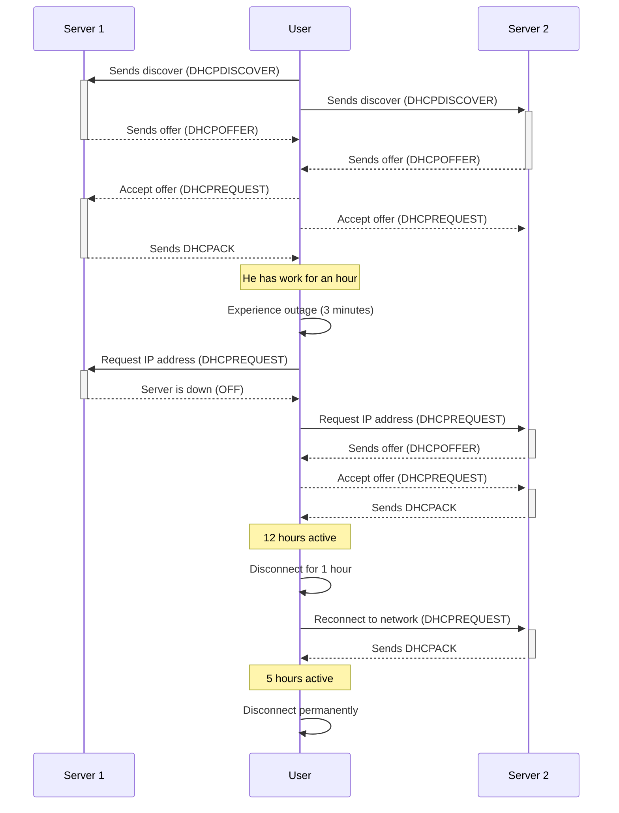

# Assignment-1-DHCP-schema

```mermaid
sequenceDiagram

    participant dhcp1 as Server 1
    participant user as User
    participant dhcp2 as Server 2

    user->>+dhcp1: Sends discover (DHCPDISCOVER)
    user->>+dhcp2: Sends discover (DHCPDISCOVER)
    dhcp1-->>-user: Sends offer (DHCPOFFER)
    dhcp2-->>-user: Sends offer (DHCPOFFER)
    user-->>+dhcp1: Accept offer (DHCPREQUEST)
    user-->>+dhcp2: Accept offer (DHCPREQUEST)
    dhcp1-->>-user: Sends DHCPACK

    note over user: He has work for an hour

    user->>user: Experience outage (3 minutes)
    user->>+dhcp1: Request IP address (DHCPREQUEST)
    dhcp1-->>-user: Server is down (OFF)
    user->>+dhcp2: Request IP address (DHCPREQUEST)
    dhcp2-->>-user: Sends offer (DHCPOFFER)
    user-->>+dhcp2: Accept offer (DHCPREQUEST)
    dhcp2-->>-user: Sends DHCPACK
    note over user: 12 hours active

    user->>user: Disconnect for 1 hour
    user->>+dhcp2: Reconnect to network (DHCPREQUEST)
    dhcp2-->>-user: Sends DHCPACK
    note over user: 5 hours active

    user->>user: Disconnect permanently
```

